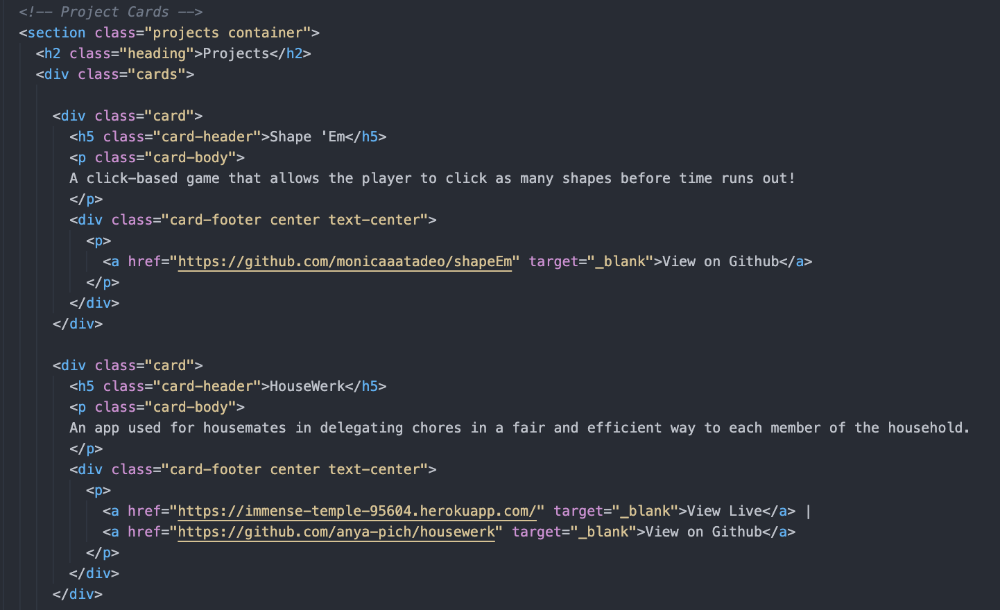

# Monica Tadeo's Portfolio

## Technologies Used 
HTML, CSS, JavaScript

## My Approach
I wanted a simple and clean portfolio that just displayed everything straight-to-the-point. I wanted to display something easy for the user and nothing too complicated. 

## Unsolved Problems/Challenges
I tried to incorporate modals to this portfolio, but I was unsucessful in how I wanted them to turn out. I haven't figured it out white yet, but it's a work in progress. 

## Wins
I reached my vision of how I wanted my entire website to look like! It might look too plain/simple to some, but I do like that clean simple look. 

## Snippets 

## Credits 
[Wing CSS](https://kbrsh.github.io/wing/)

[Smooth Scrolling](http://callmecavs.com/jump.js/)

[Animations - Animate.css](https://animate.style/)

[Formspree](https://formspree.io/)